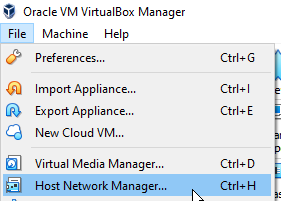
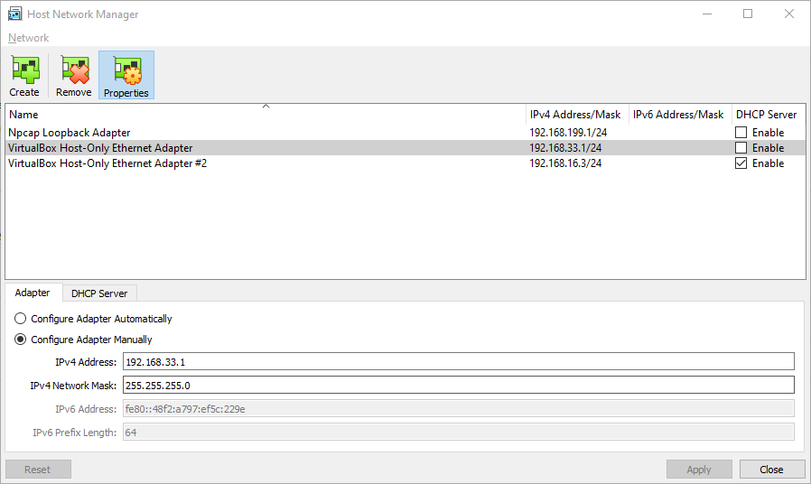
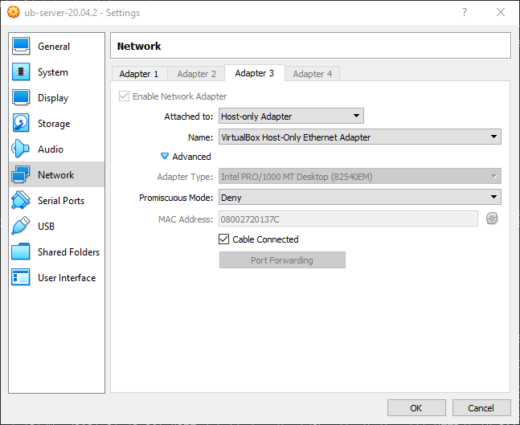

# Preparing environment for using docker in VirtualBox VM
Used following versions:
```
VirtualBox Graphical User Interface
Version 6.1.16 r140961 (Qt5.6.2)
+
Ubuntu Server 20.04.2
```

## Installing Guest Addition
1. Start the VM
2. Devices -> Insert the Guest Additions CD image
3. Mount the CD in the guest system:
```
sudo mkdir /media/cdrom
sudo mount -t iso9660 /dev/cdrom /media/cdrom
```
4. Install dependencies:
```
sudo apt-get update
sudo apt-get install -y build-essential linux-headers-`uname -r`
```
5. Run installation script:
```
sudo /media/cdrom/VBoxLinuxAdditions.run
```
6. Reboot VM:
```
sudo reboot now
```

## Sharing host folder
1. Go to settings of the VM
2. Shared Folders section
3. Add new shared folder
4. Make sure "Make permanent" is checked
5. Remember the Folder Name (host-folder-name)  


## Mounting host folder in guest
1. Make folder used for sharing
```
mkdir /home/username/shared-folder
```
3. Mount the shared folder
```
sudo mount -t vboxsf host-folder-name /home/username/shared-folder
```

## Making shared folder persistent
1. Edit `fstab`
```
sudo vi /etc/fstab
```
by adding following line (tabs-delimited):
```
shared  /home/username/shared-folder    vboxsf  defaults    0   0
```
2. Edit `modules`
```
sudo vi /etc/modules
```
by adding a following line:
```
vboxsf
```
3. Reboot the VM
```
sudo reboot now
```

## Adding host-only interface
1. File -> Network Manager (Ctrl+H)  

2. Either add new adapter or edit existing by disabling DHCP and setting the adapter's IP address  


## Setting host-only interface to be used by a VM
1. Turn the VM off
2. Go to VM's settings (Machine -> Settings or Host+S)
3. Choose Network
4. Add a Host-only adapter alongside the NAT one (make sure Name of the adapter is the same as the interface added/edited above)  

5. Power on the VM
6. Use a following command to check whether the interface is visible
```
ip addr show
```

## Make sure the IP is assigned to the interface
1. Turn the interface link down
```
ip link set interface down
```
2. Assign the IP to the interface (from a proper pool)
```
ip addr add ip_address dev interface_name
```
3. Check the IP address assignment
```
ip addr show
```
4. Turn the link up
```
ip link set interface up
```
5. Ping the IP address from host and check if it responses
6. This can also go the other way around (guest -> host)

Based on:
```
https://gist.github.com/estorgio/0c76e29c0439e683caca694f338d4003
https://www.tecmint.com/ip-command-examples/
```